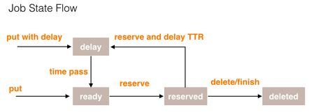
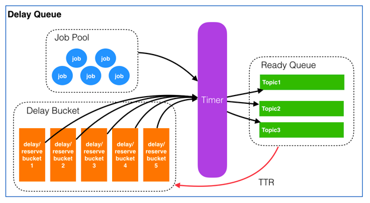

## 基于Redis的延迟消息队列
参考[有赞延迟队列](https://tech.youzan.com/queuing_delay/)  
参考[delay-queue](https://github.com/yangwenjie88/delay-queue)

## 实现功能
   实现了一个带有延迟功能的消息队列. 所谓延迟功能, 即消息(任务)在到达后, 可以选择暂时不执行, 必须达到指定的时间才能被执行. 该时间可以理解为"最早  
   可执行时间", 再该时间之前, 消息(任务)不能被执行. 应用场景举例:
   1. 预约系统: 预约成功后, 在约定时间之前的一个小时为用户发送提醒.
   2. 订单系统: 订单生成后, 若半个小时候仍处于未支付状态, 则关闭该订单.

## 消息(Job)结构
Job类包含以下属性:
1. id：Job的唯一标识, 这里采用snowflake实现.
2. delayTime：Job需要延迟执行时间点, 即Job在该时间之后才可以被执行.
3. ttrTime: time-to-run, Job的执行超时时间, 超出这个时间则该Job将重新进入ready状态. 其可以保证消息传输的可靠性. 
4. topic：Job类型, 可以理解成具体的业务名称。
5. message：Job的内容，供消费者做具体的业务处理，以json格式存储。

## 消息(Job)的状态转换
每个Job都会处于以下状态之一:
1. delay：延迟执行状态，在delayTime之前不能被执行, 位于某个DelayBucket之中.
2. ready：可执行状态，即当前时间已经大于其delayTime, 位于ReadyQueue之中, 可以被消费者取出进行消费(执行).
3. deleted：已被消费完成(finish)或者已被删除(delete).
4. reserved：已被消费者取出，但还未得到消费者的响应(delete、finish), 此时该Job仍处于JobPool和DelayBucket中, 直到得到响应. 若经过ttrTime  
   后仍未得到相应, 则重新进入ready状态

## 整体结构
整个延迟队列由4个部分组成：
1. JobPool: 用来存放所有Job. 这里用redis的hash(Map)实现
2. DelayBucket组: 每个DelayBucket都是一个有序队列，存放处于delay状态的Job. 只存放Job的id和delayTime. 这里用redis的zset(ScoredSortedSet)实现
3. ReadyQueue: 存放处于ready状态的Job, 以供消费程序消费. 只存放id. 这里用redis的list(BlockingQueue)实现
4. Timer: 负责实时扫描Bucket, 将delayTime小于等于当前时间的Job放入到ReadyQueue的对应topic, 此时该Job由delay状态变为ready状态.

